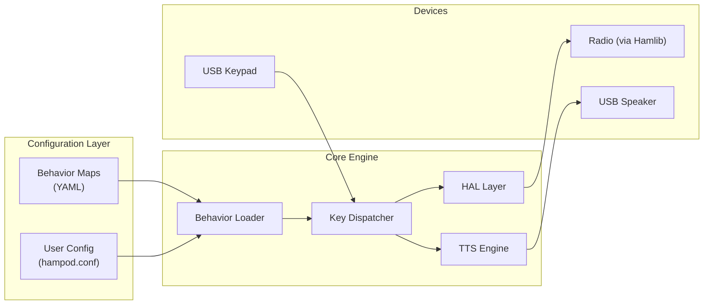
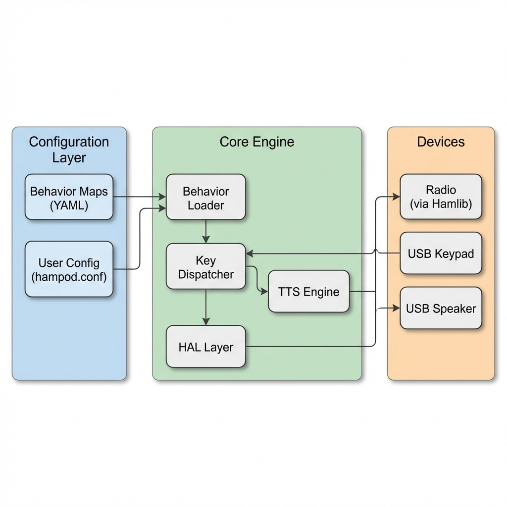
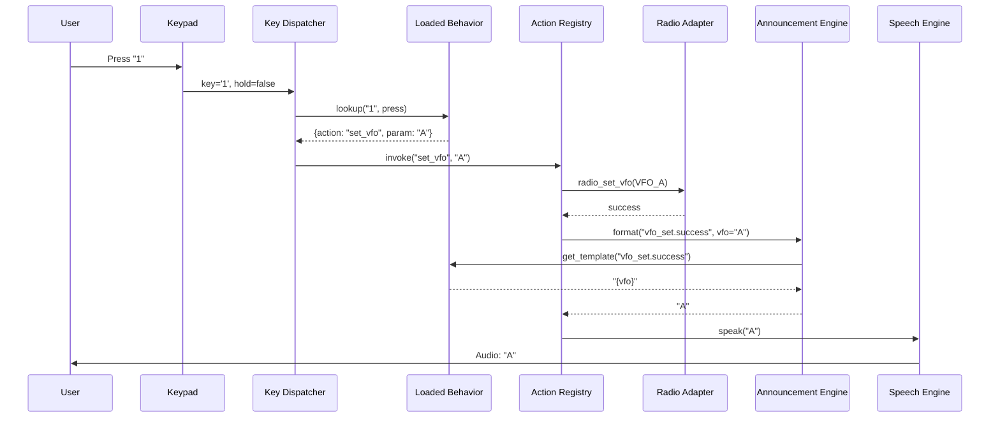

# HAMPOD Future Work: Behavior Map Architecture

**Purpose**: This document proposes a data-driven architecture to express HAMPOD behaviors in standardized, human-readable files. This allows adding or modifying radio support with minimal code changes.

---

## 1. Problem Statement

The current HAMPOD software has radio-specific logic scattered throughout C code:

| File | Hardcoded Behavior |
|------|--------------------|
| `normal_mode.c` | Key-to-function mappings, announcement text |
| `radio_queries.c` | Mode/VFO string translations |
| `set_mode.c` | Parameter constraints, toggle logic |
| `radio_setters.c` | Level ranges, available parameters |

Adding a new radio or tweaking announcements requires editing C code, rebuilding, and careful testing of unrelated functionality. There is no separation between **what a radio can do** and **how the software drives it**.

---

## 2. Proposed Solution: Behavior Maps

### 2.1 Core Concept

Replace scattered logic with declarative **Behavior Map** files (YAML format) that describe:

1. **Device Capabilities**: What features/controls the radio supports
2. **Key Bindings**: What each keypad press/hold does
3. **Announcements**: What text/format to speak for each action
4. **Hamlib Mappings**: How abstract actions map to Hamlib calls





### 2.2 Behavior Map Structure

Each radio/device gets a YAML file in `config/behaviors/`:

```
config/
├── hampod.conf              # User settings (volume, active radio, etc.)
└── behaviors/
    ├── _base.yaml           # Shared defaults for all radios
    ├── icom_ic7300.yaml     # IC-7300 specific overrides
    ├── kenwood_ts2000.yaml  # TS-2000 specific overrides
    ├── kenwood_ts570.yaml   # TS-570 specific overrides
    └── yaesu_ft991.yaml     # FT-991 specific overrides
```

#### Example: `_base.yaml` (Shared Defaults)

```yaml
# _base.yaml - Default behaviors inherited by all radios
meta:
  version: 1
  description: "Base behavior map for all radios"

# Global settings
settings:
  terse_mode: false           # If true, minimize announcement words
  frequency_speak_digits: true # Spell out decimals for clarity
  vfo_prefix: true            # Say "VFO A" vs just "A"

# VFO configuration (overridden per-radio)
vfo:
  available: [A, B]
  current_vfo_supported: false
  announcements:
    A: "VFO A"
    B: "VFO B"
    current: "Current VFO"

# Key bindings: key -> action mapping
# Supports: press, hold, shift_press, shift_hold
keybindings:
  "1":
    press:
      action: set_vfo
      parameter: A
    hold:
      action: set_vfo
      parameter: B
  "2":
    press:
      action: announce_frequency
  "0":
    press:
      action: announce_mode
  "4":
    press:
      action: query_preamp
    hold:
      action: query_agc
    shift_press:
      action: query_attenuation
  "7":
    press:
      action: query_nb
  "8":
    press:
      action: query_nr
    hold:
      action: query_mic_gain
  "9":
    shift_press:
      action: query_compression
    hold:
      action: query_power
  "*":
    press:
      action: announce_smeter
    hold:
      action: announce_power_meter
  "C":
    press:
      action: toggle_verbosity
  "#":
    press:
      action: enter_set_mode
  "Enter":
    press:
      action: cycle_vfo

# Announcements: templates for TTS output
# Uses {variable} substitution
announcements:
  frequency:
    format: "{mhz} point {decimals} megahertz"
    decimals_spoken: true    # Spell each digit
  smeter:
    format: "S {level}"
    over_s9_format: "S 9 plus {db} dB"
  power_meter:
    format: "{watts} watts"
  mode:
    # Map Hamlib mode constants to spoken text
    USB: "Upper sideband"
    LSB: "Lower sideband"
    CW: "CW"
    AM: "AM"
    FM: "FM"
  vfo_set:
    success: "{vfo}"
    failure: "{vfo} not available"
  nb:
    format_verbose: "Noise blanker {status}, level {level}"
    format_terse: "{level}"    # Only level if enabled
  nr:
    format_verbose: "Noise reduction {status}, level {level}"
    format_terse: "{level}"
  agc:
    format: "AGC {speed}"

# Capabilities: what this radio supports
capabilities:
  frequency: true
  mode: true
  vfo_select: true
  nb: true
  nr: true
  agc: true
  preamp: true
  attenuation: true
  compression: true
  power_control: true
  mic_gain: true
  smeter: true
  power_meter: true
```

#### Example: `icom_ic7300.yaml` (Icom Override)

```yaml
# icom_ic7300.yaml - Icom IC-7300 specific behaviors
meta:
  version: 1
  extends: _base        # Inherit from base
  hamlib_model: 3073
  description: "Icom IC-7300 transceiver"

# Icom supports "Current VFO" concept
vfo:
  available: [A, B, current]
  current_vfo_supported: true
  announcements:
    A: "A"
    B: "B"
    current: "Current"

# Override Enter key for VFO cycling (Icom style)
keybindings:
  "Enter":
    press:
      action: cycle_vfo
      sequence: [current, A, B]   # Icom-specific cycle order
```

#### Example: `kenwood_ts2000.yaml` (Kenwood Override)

```yaml
# kenwood_ts2000.yaml - Kenwood TS-2000 specific behaviors
meta:
  version: 1
  extends: _base
  hamlib_model: 2014
  description: "Kenwood TS-2000 transceiver"

# TS-2000 has VFO A, B, and C
vfo:
  available: [A, B, C]
  current_vfo_supported: false
  announcements:
    A: "A"
    B: "B"
    C: "C"

keybindings:
  "Enter":
    press:
      action: cycle_vfo
      sequence: [A, B, C]
```

---

## 3. New Software Architecture

### 3.1 Module Breakdown

```
Software2/
├── src/
│   ├── main.c                    # Application entry, startup
│   ├── behavior_loader.c         # [NEW] Parse YAML behavior maps
│   ├── behavior_loader.h
│   ├── behavior_types.h          # [NEW] Behavior data structures
│   ├── action_registry.c         # [NEW] Map action names to functions
│   ├── action_registry.h
│   ├── key_dispatcher.c          # [NEW] Generic key dispatch from bindings
│   ├── key_dispatcher.h
│   ├── announcement_engine.c     # [NEW] Template-based TTS formatting
│   ├── announcement_engine.h
│   ├── radio_adapter.c           # [REFACTOR] Thin Hamlib wrapper
│   ├── radio_adapter.h
│   ├── config.c                  # User config (volume, active radio)
│   ├── speech.c                  # TTS backend (Piper)
│   └── keypad.c                  # HID input handling
└── config/
    ├── hampod.conf
    └── behaviors/
        ├── _base.yaml
        ├── icom_ic7300.yaml
        └── kenwood_ts2000.yaml
```

### 3.2 Component Responsibilities

| Component | Responsibility |
|-----------|----------------|
| **Behavior Loader** | Parse YAML files, merge inheritance (`extends`), build runtime behavior struct |
| **Action Registry** | Map action name strings (e.g., `"announce_frequency"`) to C function pointers |
| **Key Dispatcher** | On keypad event, look up action from loaded bindings, invoke via registry |
| **Announcement Engine** | Format TTS strings from templates, handle terse/verbose modes |
| **Radio Adapter** | Simplified Hamlib interface; capabilities checked against behavior map |

### 3.3 Data Flow




### 3.4 Startup Sequence

1. Load `hampod.conf` to get active radio model number
2. Behavior Loader scans `config/behaviors/` for matching `hamlib_model`
3. If found, load that file; otherwise fall back to `_base.yaml`
4. Merge behavior with base (inheritance via `extends`)
5. Register available actions based on `capabilities` section
6. Initialize radio connection via Radio Adapter
7. Start key event loop with loaded bindings

---

## 4. Benefits

| Benefit | Explanation |
|---------|-------------|
| **Easy radio addition** | Copy closest behavior file, change `hamlib_model` and overrides |
| **No code changes for tweaks** | Adjust announcements, key mappings, verbosity in YAML |
| **Hot reload** (optional) | Could reload behaviors without restart (send signal) |
| **Separation of concerns** | Domain knowledge (radio behavior) vs implementation (C code) |
| **Testable** | Mock behavior files for unit tests |
| **Documented** | YAML files serve as documentation of each radio's interface |

---

## 5. Migration Strategy

This is a substantial refactor. Recommended phased approach:

### Phase 1: Proof of Concept (2-3 weeks)
- Implement `behavior_loader.c` with libyaml or custom parser
- Create `_base.yaml` encoding current hardcoded behavior
- Refactor `normal_mode_handle_key()` to use key_dispatcher for 2-3 keys

### Phase 2: Full Key Dispatch (2-3 weeks)
- Convert all key handling to dispatcher
- Remove hardcoded switch statements from `normal_mode.c`
- Implement action_registry with all current actions

### Phase 3: Announcement Engine (1-2 weeks)
- Template-based announcement formatting
- Terse/verbose mode support
- Radio-specific announcement overrides

### Phase 4: Multi-Radio Support (1-2 weeks)
- Create behavior files for IC-7300, TS-2000, TS-570
- Test switching between radios
- Verify inheritance/override system works

### Phase 5: Polish & Documentation (1 week)
- Write behavior file authoring guide
- Create template for new radios
- Update README

---

## 6. Dependencies

| Dependency | Purpose | Notes |
|------------|---------|-------|
| **libyaml** | YAML parsing | Small, C89 compatible, widely available |
| (Alternative) **Custom parser** | If dependencies are a concern | YAML subset parser is ~500 lines |

---

## 7. Open Questions

1. **Hot reload**: Should behavior files be reloadable at runtime, or only at startup?
2. **Keypad layout mapping**: Should physical key positions also be configurable (e.g., user prefers different 1-2-3 arrangement)?
3. **Set Mode parameters**: Should parameter constraints (min/max values) live in behavior files?
4. **Multiple devices**: If supporting antenna rotors, should they have separate behavior files?
5. **Validation**: Should there be a `hampod --validate-behaviors` command for testing files?

---

## 8. Appendix: Current vs Proposed Comparison

### Example: VFO Selection (Key "1")

**Current Code** (`normal_mode.c`):
```c
if (key == '1') {
    if (!is_hold) {
        frequency_mode_suppress_next_poll();
        if (radio_set_vfo(RADIO_VFO_A) == 0) {
            speech_say_text("VFO A");
            announce_frequency();
        } else {
            speech_say_text("VFO A not available");
        }
    } else {
        frequency_mode_suppress_next_poll();
        if (radio_set_vfo(RADIO_VFO_B) == 0) {
            speech_say_text("VFO B");
            announce_frequency();
        } else {
            speech_say_text("VFO B not available");
        }
    }
    return true;
}
```

**Proposed** (behavior file + generic code):

`_base.yaml`:
```yaml
keybindings:
  "1":
    press: {action: set_vfo, parameter: A}
    hold:  {action: set_vfo, parameter: B}
announcements:
  vfo_set:
    success: "VFO {vfo}"
    failure: "{vfo} not available"
```

`key_dispatcher.c`:
```c
// Generic dispatcher - no radio-specific logic
void dispatch_key(char key, bool is_hold, bool is_shifted) {
    const Binding* b = behavior_lookup_key(g_behavior, key, is_hold, is_shifted);
    if (b) {
        action_invoke(b->action, b->parameter);
    }
}
```

`action_registry.c`:
```c
// Reusable action implementation
void action_set_vfo(const char* param) {
    RadioVfo vfo = parse_vfo(param);  // "A" -> RADIO_VFO_A
    frequency_mode_suppress_next_poll();
    if (radio_set_vfo(vfo) == 0) {
        announce_template("vfo_set.success", "vfo", param);
        action_announce_frequency(NULL);
    } else {
        announce_template("vfo_set.failure", "vfo", param);
    }
}
```

The key difference: **Radio-specific behavior is now in the YAML file**, not in C code.
