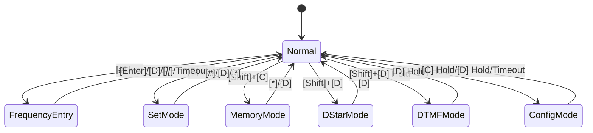
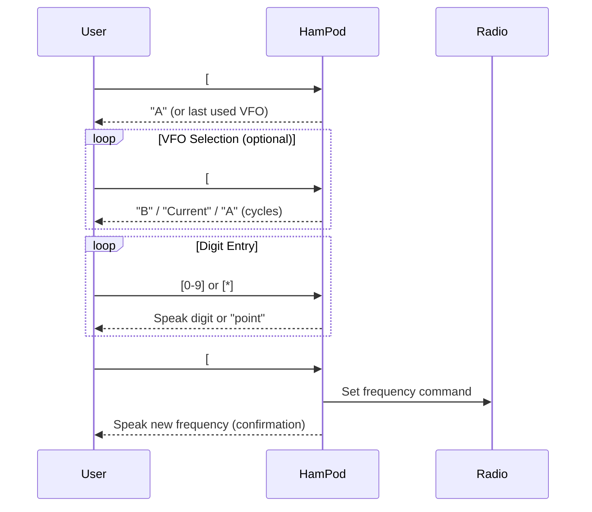

# ICOM Reader Implementation Specification

> **Document Purpose**: This is a developer-focused rewrite of `ICOMReader_Manual_v106.txt` combined with clarifications from `ICOMReader_Manual_Add_On.txt`. It eliminates ambiguity and provides precise behavior specifications for implementation.

---

## Table of Contents

1. [System Architecture](#1-system-architecture)
2. [Mode System](#2-mode-system)
3. [Key Input System](#3-key-input-system)
4. [Normal Mode](#4-normal-mode)
5. [Frequency Entry Mode](#5-frequency-entry-mode)
6. [Set Mode](#6-set-mode)
7. [Memory Mode](#7-memory-mode)
8. [DStar Mode](#8-dstar-mode)
9. [DTMF Mode](#9-dtmf-mode)
10. [Configuration Mode](#10-configuration-mode)
11. [Audio Feedback System](#11-audio-feedback-system)
12. [Configuration Parameters](#12-configuration-parameters)
13. [Error Handling](#13-error-handling)
14. [Special Frequencies](#14-special-frequencies)

---

## 1. System Architecture

### 1.1 Hardware Interface

| Component | Specification |
|-----------|---------------|
| Serial Ports | 2× male DB9 connectors (port 1 nearest power jack) |
| Baud Rate | 19,200 bps (ICOM CI-V protocol) |
| Power | 9-15V DC, center-positive, 2.1mm × 5.5mm jack |
| Keypad | 16 buttons in 4×4 matrix |
| Audio Output | 3.5mm mono headphone jack (some models) |

### 1.2 Keypad Layout

```
╔═══════╦═══════╦═══════╦═══════╗
║   1   ║   2   ║   3   ║   A   ║  ← Row 1
╠═══════╬═══════╬═══════╬═══════╣
║   4   ║   5   ║   6   ║   B   ║  ← Row 2
╠═══════╬═══════╬═══════╬═══════╣
║   7   ║   8   ║   9   ║   C   ║  ← Row 3
╠═══════╬═══════╬═══════╬═══════╣
║   *   ║   0   ║   #   ║   D   ║  ← Row 4
╚═══════╩═══════╩═══════╩═══════╝
```

### 1.3 Radio Communication

- **Polling**: The HamPod polls for a connected ICOM radio at ~1 second intervals
- **Connection**: On detection, announces the ICOM ID number
- **Protocol**: All frequency commands use Hamlib (CI-V under the hood)

---

## 2. Mode System

### 2.1 Mode Hierarchy



### 2.2 Mode List

| Mode | Entry Method | Exit Method | Purpose |
|------|--------------|-------------|---------|
| **Normal** | Default/Exit from other modes | — | Query radio parameters |
| **Frequency Entry** | `[#]` | `[#]` (submit), `[D]` (cancel), `[*][*]` (cancel), timeout | Direct frequency input |
| **Set Mode** | `[B]` | `[#]` (submit), `[D]` (cancel), `[*]` (cancel) | Modify radio parameters |
| **Memory Mode** | `[Shift]+[C]` | `[*]` or `[D]` | View/transfer/clear memory channels |
| **DStar Mode** | `[Shift]+[D]` | `[D]` | DStar callsign and text entry |
| **DTMF Mode** | `[Shift]+[D] Hold` | `[D] Hold` | Generate DTMF tones |
| **Configuration** | `[C] Hold` (1 sec) | `[C] Hold` (save), `[D] Hold` (discard), timeout (discard) | HamPod settings |

---

## 3. Key Input System

### 3.1 Key Press Types

| Press Type | Detection | Behavior |
|------------|-----------|----------|
| **Short Press** | Key released before 500ms | Standard action |
| **Long Press (Hold)** | Key held ≥500ms | Alternate action |

### 3.2 Shift Mechanism

The `[A]` key acts as a **SHIFT** modifier in Normal Mode:

1. Press `[A]` → SHIFT activates (announced as "Shift")
2. Press next key → SHIFT action executes
3. SHIFT automatically deactivates after action

> **Note**: Keys are **never** pressed simultaneously. All input is sequential.

### 3.3 Audio Feedback on Key Press

| Condition | Feedback |
|-----------|----------|
| Key initially pressed (key beep enabled) | Short beep |
| Key held ≥500ms | Second lower-pitch beep |
| Invalid key in current mode | Low-frequency error beep |

### 3.4 Keypad Timeout

| Setting | Behavior |
|---------|----------|
| Disabled | No timeout; waits indefinitely |
| 5-30 seconds | Timer resets on each keypress; on expiration, says "timeout" and returns to Normal Mode |

The timeout applies during:
- Frequency Entry Mode (after any key press)
- Configuration Mode (after any key press)
- VFO selection phase (after `[#]` pressed)

---

## 4. Normal Mode

### 4.1 Key Mapping Overview

Each key can have up to **6 actions**:
1. Short press
2. Long press (Hold)
3. `[Shift]` + Short press
4. `[Shift]` + Long press
5. `[Set]` + Short press
6. `[Set]` + `[Shift]` + combinations

### 4.2 Complete Key Reference

#### Key [1] - VFO Selection

| Action | Behavior |
|--------|----------|
| `[1]` | Select VFO A, announce frequency |
| `[1] Hold` | Select VFO B, announce frequency |
| `[Set]+[1]` | Select Main receiver (IC-7800/7851/9100/9700) |
| `[Set]+[1] Hold` | Select Sub receiver (IC-7800/7851/9100/9700) |
| `[Shift]+[1]` | Report VOX status, Gain, Anti-Gain levels |
| `[Set]+[Shift]+[1]` | Set VOX parameters |
| `[Shift]+[1] Hold` | Report Break-in status and Delay level |

#### Key [2] - Frequency & Tuning

| Action | Behavior |
|--------|----------|
| `[2]` | Announce current working VFO frequency |
| `[2] Hold` | Toggle Memory Scan On/Off |
| `[Shift]+[2]` | Report Tuning Step |
| `[Set]+[Shift]+[2]` | Set Tuning Step (0-12 depending on model) |
| `[Shift]+[2] Hold` | Report RF/Squelch Control setting |
| `[Set]+[Shift]+[2] Hold` | Set RF/Squelch Control (0=Auto, 1=Squelch, 2=RF+Squelch) |

#### Key [3] - Split & Duplex

| Action | Behavior |
|--------|----------|
| `[3]` | Toggle Split Mode On/Off |
| `[3] Hold` | Exchange VFO A and VFO B |
| `[Shift]+[3]` | Cycle Duplex direction (minus→plus→disabled), announce offset; OR disable Dual Watch (IC-775/7610/7851) |
| `[Set]+[Shift]+[3]` | Set Duplex Offset frequency (enter in kHz, up to 4 digits) |
| `[Shift]+[3] Hold` | Turn on Dual Watch (IC-775/7610/7851) |

#### Key [A] - Shift & Volume

| Action | Behavior |
|--------|----------|
| `[A]` | Toggle SHIFT on/off |
| `[A] Hold` | Volume Up |
| `[Shift]+[A]` | Turn SHIFT off if currently on |
| `[Shift]+[A] Hold` | Not assigned |

#### Key [4] - PreAmp & AGC

| Action | Behavior |
|--------|----------|
| `[4]` | Report PreAmp status |
| `[Set]+[4]` | Set PreAmp 1/2 status |
| `[4] Hold` | Report AGC status (slow/mid/fast) and level (0-13) |
| `[Shift]+[4]` | Report Attenuation status |
| `[Set]+[Shift]+[4]` | Set Attenuation level |

#### Key [5] - Tones

| Action | Behavior |
|--------|----------|
| `[5]` | Report Repeater, CTCSS, DTCS Tone status and frequency/code |
| `[Set]+[5]` | Set Repeater Tone |
| `[Set]+[5] Hold` | Set CTCSS Squelch Tone |
| `[Set]+[Shift]+[5]` | Set DTCS ([A]=On, [B]=Off, [C]=Polarity) |
| `[Shift]+[5] Hold` | Report Digital Voice Squelch status/code |
| `[Set]+[Shift]+[5] Hold` | Set Digital Voice Squelch |

#### Key [6] - Filters

| Action | Behavior |
|--------|----------|
| `[6]` | Report selected Filter Width |
| `[6] Hold` | Report Audio Peak Filter |
| `[Shift]+[6]` | Report Filter Number |
| `[Set]+[Shift]+[6]` | Set Filter Number |
| `[Shift]+[6] Hold` | Report Roofing Filter |

#### Key [B] - Band/Set Mode

| Action | Behavior |
|--------|----------|
| `[B]` | Enter Set Mode (cycles Set→Band→Off if band stacking available) |
| `[B] Hold` | Volume Down |
| `[Shift]+[B]` | Debug Mode (speaks CI-V data) |

#### Key [7] - Noise Blanker & Tuner

| Action | Behavior |
|--------|----------|
| `[7]` | Report Noise Blanker status and Level |
| `[Set]+[7]` | Set Noise Blanker status and Level |
| `[7] Hold` | Report Antenna Tuner status (Off/On/Tuning) |
| `[Shift]+[7]` | Report Antenna Selection |
| `[Shift]+[7] Hold` | Report Voltage and Current (firmware v2.xx only) |

#### Key [8] - Noise Reduction & Mic

| Action | Behavior |
|--------|----------|
| `[8]` | Report Noise Reduction status and Level |
| `[Set]+[8]` | Set Noise Reduction status and Level |
| `[8] Hold` | Report Mic Gain Level |
| `[Set]+[8] Hold` | Set Mic Gain Level |
| `[Shift]+[8]` | Report Keyer Speed |
| `[Set]+[Shift]+[8]` | Set Keyer Speed |

#### Key [9] - Notch, Power & Compression

| Action | Behavior |
|--------|----------|
| `[9]` | Report Auto Notch status, Manual Notch status and Frequency |
| `[9] Hold` | Report Power Level |
| `[Set]+[9] Hold` | Set Power Level |
| `[Shift]+[9]` | Report Compression status and Level |
| `[Set]+[Shift]+[9]` | Set Compression Level |
| `[Shift]+[9] Hold` | Report Monitor status and Level |
| `[Set]+[Shift]+[9] Hold` | Set Monitor Level |

#### Key [C] - Frequency Announcement & Config

| Action | Behavior |
|--------|----------|
| `[C]` | Toggle Frequency Announcement Delay on/off |
| `[C] Hold` | Enter Configuration Mode |
| `[Shift]+[C]` | Enter Memory Mode |
| `[Shift]+[C] Hold` | Enter Memory Mode 2 (auto-transfer to VFO) |

#### Key [*] - Meters

| Action | Behavior |
|--------|----------|
| `[*]` | Report S-Meter |
| `[*] Hold` | Report RF Power Meter |
| `[Shift]+[*]` | Report Compression Meter |
| `[Shift]+[*] Hold` | Report ALC Meter |

#### Key [0] - Mode & SWR

| Action | Behavior |
|--------|----------|
| `[0]` | Report current operating Mode |
| `[Set]+[0]` | Set current Mode |
| `[0] Hold` | Toggle Data Mode On/Off |
| `[Shift]+[0]` | SWR query (stays in TX until key pressed) |
| `[Shift]+[0] Hold` | SWR reading (15% power, tuner bypassed) |

#### Key [#] - Frequency Entry

| Action | Behavior |
|--------|----------|
| `[#]` | Enter Frequency Entry Mode; cycle VFO selection (A→B→Current→A...) |
| `[#] Hold` | Query current Time (select models only) |
| `[Set]+[#] Hold` | Set current Time (4 digits, 24hr format) |
| `[Shift]+[#]` | Recall last entered frequency |
| `[Shift]+[#] Hold` | Save current frequency to recall buffer |

#### Key [D] - Verbosity & Ports

| Action | Behavior |
|--------|----------|
| `[D]` | Toggle Verbosity on/off |
| `[D] Hold` | Switch between serial ports 1 and 2 |
| `[Shift]+[D]` | Enter DStar Mode |
| `[Set]+[Shift]+[D]` | Set Dial/Panel Lock |
| `[Shift]+[D] Hold` | Enter DTMF Mode |

---

## 5. Frequency Entry Mode

### 5.1 Mode Overview

Frequency Entry Mode provides direct numeric input for VFO frequencies. All frequencies are entered in **MHz**.

### 5.2 Entry Sequence



### 5.3 Key Behaviors in Frequency Entry Mode

| Key | Behavior |
|-----|----------|
| `[0-9]` | Append digit to buffer; speak digit |
| `[*]` (first press) | Insert decimal point; speak "point" |
| `[*]` (second press) | Clear entry, speak "clear", exit to Normal Mode |
| `[#]` (Enter) | Submit frequency to radio; speak resulting frequency |
| `[D]` | Clear entry, speak "clear", exit to Normal Mode |
| `[A]`, `[B]`, `[C]` | Low-frequency error beep; ignored |
| Any Hold action | Disabled; treated as short press |

### 5.4 Input Buffer Specification

| Property | Value |
|----------|-------|
| Maximum buffer size | 11 characters |
| 12th digit | Error beep, digit rejected |
| Example max entry | `1234.123456` |
| Leading zeros | Accepted but ignored in value |

### 5.5 Frequency Format Rules

| Input | Interpretation | Notes |
|-------|----------------|-------|
| `14.250` | 14.250 MHz | Standard format |
| `14.` | 14.000 MHz | Trailing zeros assumed |
| `.250` | 0.250 MHz = 250 kHz | Leading dot for kHz entry |
| `14` | 14 MHz | No decimal = whole MHz |
| `0` | Invalid | Fills buffer with zeros; no command sent |
| Empty + `[#]` | No effect | Cycles VFO selection instead |

### 5.6 Frequency Announcement Format

When announcing a frequency:
1. Trailing zeros after the 1 kHz position are **not spoken**
2. The second decimal point (if present) is spoken as "**dot**" instead of "point"

Example: `7.240000` is announced as "seven point two four zero"

### 5.7 Exit Conditions

| Condition | Speech |
|-----------|--------|
| Successful submission `[#]` | Speaks confirmed frequency from radio |
| Cancel via `[D]` | "clear" |
| Cancel via `[*][*]` | "clear" |
| Keypad timeout | "timeout" |
| Invalid entry (`0`) | Silent; exits without sending |

---

## 6. Set Mode

### 6.1 Mode Overview

Set Mode allows modification of radio parameters. It is **not a separate mode** but rather a modifier flag that changes how Normal Mode keys behave—specifically enabling **write** operations instead of just **read**.

### 6.2 Entry and Exit

| Action | Result |
|--------|--------|
| `[B]` (from Normal) | Cycle: Set → Band → Off (if band stacking available) OR Set → Off |
| `[#]` (Enter) | Submit current setting, exit Set Mode |
| `[D]` | Cancel, exit Set Mode |
| `[*]` | Cancel, exit Set Mode |

### 6.3 Common Control Keys in Set Mode

| Key | Function |
|-----|----------|
| `[A]` | Toggle On / Increment / Next option |
| `[B]` | Toggle Off / Decrement / Previous option |
| `[C]` | Cycle through sub-options (e.g., VOX Gain vs Anti-Gain) |
| `[0-9]` | Enter numeric value |
| `[#]` | Confirm and send to radio |

### 6.4 Settable Parameters

#### PreAmp (`[Set]+[4]`)
- `[1]`: Enable PreAmp 1, disable PreAmp 2
- `[2]`: Enable PreAmp 2, disable PreAmp 1
- `[0]`: Disable all PreAmps
- Stays in Set Mode; press `[#]` or `[D]` to exit

#### Attenuation (`[Set]+[Shift]+[4]`)
- Enter 0-45 dB (model-dependent valid values)
- `[#]` to submit and exit

#### Filter Width (`[Set]+[6]`)
- `[1] Hold`: Sharp DSP filter shape
- `[2] Hold`: Soft DSP filter shape
- `[0-9]`: Enter filter width value (0-57+ depending on model)
- `[#]` to submit

#### AGC (`[Set]+[4] Hold`)
- `[1] Hold`: Fast AGC
- `[2] Hold`: Mid AGC
- `[3] Hold`: Slow AGC
- `[0-9]`: Enter level (0-13)
- `[#]` to submit and exit

#### Notch Filter (`[Set]+[7]` — **Note: Document says [7] but likely meant for notch mode**)
- `[A]`: Enable Auto or Manual Notch (selected by `[C]`)
- `[B]`: Disable Auto or Manual Notch
- `[C]`: Toggle between Auto and Manual Notch
- `[1] Hold`: Wide manual notch width
- `[2] Hold`: Mid manual notch width
- `[3] Hold`: Narrow manual notch width
- `[0-9]`: Set notch frequency (0-100)
- `[#]` to submit and exit

#### VOX (`[Set]+[Shift]+[1]`)
- `[A]`: Enable VOX
- `[B]`: Disable VOX
- `[C]`: Cycle between Gain, Anti-Gain, Delay
- `[0-9]`: Enter value for selected control
- `[#]` to send

#### Other Settable Parameters
- Tuning Step, RF/Squelch Control, Duplex Offset, Dial/Panel Lock, etc.

### 6.5 Quick Band Change

For models with Band Stacking Registers:

1. Press `[B]` until "Band" is announced
2. Press `[0-9]`, `[C]`, or `[D]` for immediate band change:
   - `[1]`=160m, `[2]`=80m, `[3]`=60m, `[4]`=40m, `[5]`=20m
   - `[6]`=17m, `[7]`=15m, `[8]`=12m, `[9]`=10m, `[0]`=6m
   - `[C]`=UHF, `[D]`=1.2G (IC-7100/9100 only)

---

## 7. Memory Mode

### 7.1 Mode Overview

Memory Mode allows viewing, transferring, saving, and clearing memory channels. The **radio itself does not change mode**—it stays in VFO mode unless a clear operation is performed.

### 7.2 Entry and Exit

| Action | Result |
|--------|--------|
| `[Shift]+[C]` | Enter Memory Mode (review mode) |
| `[Shift]+[C] Hold` | Enter Memory Mode 2 (auto-transfer to VFO) |
| `[*]` or `[D]` | Exit to Normal Mode (if no data pending) |

### 7.3 Key Behaviors

| Key | Behavior |
|-----|----------|
| `[A]` | Increment channel, announce data |
| `[B]` | Decrement channel, announce data |
| `[0-9]` | Enter channel number (up to 3 digits) |
| `[#]` | After channel entered: go to that channel; After VFO selected: transfer and exit |
| `[0-5] Hold` | Select Memory Bank 0-5 (model-dependent) |
| `[C]` | Cycle transfer destination: VFO A → VFO B → Modify Name |
| `[C] Hold` | **Immediate** save current VFO to selected channel |
| `[*]` | Clear pending input, or exit if nothing pending |
| `[*] Hold` | **Immediate** clear selected memory channel |

### 7.4 Channel Announcement Format

When a channel is accessed:
1. Channel number
2. Alpha-numeric label (if populated)
3. RX frequency
4. Operating mode letter (if Frequency Plus Mode enabled)

### 7.5 Memory Operations

#### Transfer Memory to VFO
1. Navigate to desired channel (`[A]`/`[B]` or direct entry)
2. Press `[C]` to select target VFO (A or B)
3. Press `[#]` to transfer and exit

#### Save VFO to Memory
1. Navigate to desired channel location
2. Press `[C] Hold` — **immediate, no confirmation**
3. Exits to Normal Mode

#### Clear Memory Channel
1. Navigate to channel to clear
2. Press `[*] Hold` — **immediate, no confirmation**
3. Radio switches to VFO Mode (even if it was in Memory Mode)
4. Exits to Normal Mode

### 7.6 Memory Channel Name Tags

To assign a name to a memory channel using the DStar Text Buffer:
1. Enter DStar Mode (`[Shift]+[D]`)
2. Enter text starting with lowercase `m` followed by desired name
3. Exit DStar Mode (`[D]`)
4. Enter Memory Mode, select target channel
5. Press `[C]` until "Modify Name" is announced
6. Press `[#]` to write

---

## 8. DStar Mode

### 8.1 Mode Overview

DStar Mode provides text entry and management for DStar callsigns and parameters. It uses an editable text buffer.

### 8.2 DStar Fields

| Field | Size | Purpose |
|-------|------|---------|
| My Callsign | 12 chars | Your callsign (8) + short note (4) |
| TX Callsign | 24 chars | UR Callsign (8) + RPT1 (8) + RPT2 (8) |
| TX Message | 20 chars | Free-form text message |

### 8.3 Key Mapping

| Key | Behavior |
|-----|----------|
| `[0-9]` | Select character to write (multi-tap style) |
| `[A]` | Write selected char to buffer at cursor, advance cursor |
| `[B]` | Move cursor back one position |
| `[B] Hold` | Convert current char to lowercase |
| `[C]` | Select DStar field (My Callsign / TX Callsign / TX Message) |
| `[C] Hold` | Copy field data into editable buffer |
| `[#]` | Read selected field from radio |
| `[#] Hold` | Write buffer to selected field in radio |
| `[*]` | Write null (end-of-string) at cursor |
| `[*] Hold` | Clear entire buffer |
| `[1] Hold` | Read buffer contents aloud |
| `[2] Hold` | Read buffer letter-by-letter |
| `[D]` | Exit DStar Mode |

### 8.4 DStar Hot Keys

| Key | Action | Buffer Content |
|-----|--------|----------------|
| `[4] Hold` | Link | Sets 8th char to "L", sends TX Callsign |
| `[5] Hold` | Talk | Sets first 8 chars to "CQCQCQ  ", sends |
| `[6] Hold` | Unlink | Sets first 8 chars to "       U", sends |
| `[7] Hold` | Relink | Restores saved UR Callsign, sends |
| `[8] Hold` | Echo test | Sets first 8 chars to "       E", sends |
| `[9] Hold` | Info request | Sets first 8 chars to "       I", sends |

---

## 9. DTMF Mode

### 9.1 Mode Overview

DTMF Mode converts the keypad into a 16-key DTMF tone generator.

### 9.2 Entry and Exit

| Action | Result |
|--------|--------|
| `[Shift]+[D] Hold` | Enter DTMF Mode |
| `[D] Hold` | Exit DTMF Mode |

### 9.3 Behavior

- All 16 keys generate their corresponding DTMF tone
- Key beeps are muted during DTMF Mode
- Tone duration is configurable (100-500ms, default 200ms)

---

## 10. Configuration Mode

### 10.1 Entry and Exit

| Action | Result |
|--------|--------|
| `[C] Hold` (1 sec) | Enter Configuration Mode at last-viewed option |
| `[C] Hold` (1 sec) | Save changes to EEPROM and exit |
| `[D] Hold` (1 sec) | Discard changes and exit (changes remain until power cycle) |
| Keypad timeout | Exit without saving |

### 10.2 Navigation Keys

| Key | Function |
|-----|----------|
| `[A]` | Step forward through options |
| `[B]` | Step backward through options |
| `[C]` | Increment current parameter |
| `[D]` | Decrement current parameter |

All menus are **circular** (wrap around).

### 10.3 Invalid Keys

Only `[A]`, `[B]`, `[C]`, `[D]` are valid in Configuration Mode. All other keys produce an error beep and are ignored.

---

## 11. Audio Feedback System

### 11.1 Key Beeps

| Event | Sound |
|-------|-------|
| Key pressed (beep enabled) | Short beep |
| Key held ≥500ms | Lower-pitch beep (hold indicator) |
| Invalid key | Low-frequency error beep |

### 11.2 Status Announcements

| Trigger | Announcement |
|---------|--------------|
| Entry cleared | "clear" |
| Decimal point entered | "point" |
| Keypad timeout | "timeout" |
| Radio timeout | "radio timeout" |
| VFO selection | "A" / "B" / "Current" |
| Set Mode entry | "Set" / "Band" / "Off" |

### 11.3 Frequency Announcement Optimizations

- Trailing zeros after 1 kHz position are omitted
- Second decimal point spoken as "dot" instead of "point"
- Example: 14.250000 → "fourteen point two five zero"

### 11.4 Frequency Plus Mode Suffixes

When enabled, frequency announcements include mode suffix:

| Mode | Suffix |
|------|--------|
| LSB | "L" |
| USB | "U" |
| CW | "C" |
| CW Reverse | "CR" |
| RTTY | "R" |
| RTTY Reverse | "RR" |
| FM | "F" |
| WFM | "W" |
| AM | "A" |
| AM Sync | "S" |
| PSK | "P" |
| PSK Reverse | "PR" |
| Digital Voice | "DV" |

---

## 12. Configuration Parameters

### 12.1 Voice Parameters

| Parameter | Range | Default |
|-----------|-------|---------|
| Volume | 0-9 | 5 |
| Speed | 0-13 | 5 |
| Pitch | 0-99 | 50 |
| Articulation | 0-9 | 3 |
| Expression | 0-9 | 3 |
| Reverb | 0-9 | 0 |
| Formant Frequency | 0-99 | 50 |
| Tone | 0-2 | 1 |
| Voice (preset) | 0-10 | 0 |

### 12.2 Operational Parameters

| Parameter | Range | Default |
|-----------|-------|---------|
| Key Beep | on/off | — |
| Key Timeout Duration | off, 5-30 sec | — |
| Verbosity | on/off | — |
| Frequency Announcement | on/off | — |
| Frequency Announcement Delay | 1.2-5.0 sec (0.1s steps) | — |
| AF and RF Announcement | on/off | — |
| Frequency Plus Mode | on/off | — |
| Communications Timeout | 5-20 | — |
| ICOM ID Port 1 | 00-A0 (hex), A0=auto-acquire | — |
| ICOM ID Port 2 | 00-A0 (hex), A0=auto-acquire | — |
| DTMF Tone Duration | 100-500 ms | 200 |
| Power On To Port | 1-2 | 1 |

---

## 13. Error Handling

### 13.1 Error Responses

| Condition | Response |
|-----------|----------|
| Invalid key in current mode | Low-frequency error beep |
| Invalid frequency sent | No acknowledgment; speaks current frequency (unchanged) |
| Radio disconnected | "radio timeout" on next command |
| Invalid channel number | Error beep, entry cleared |
| Communication timeout | "radio timeout" |
| Invalid parameter value | "failed" response |

### 13.2 Recovery Behaviors

| Error | Recovery |
|-------|----------|
| Frequency entry timeout | Returns to Normal Mode |
| Radio timeout during command | Aborts operation, returns to Normal Mode |
| Config mode timeout | Exits without saving, settings remain until power cycle |

---

## 14. Special Frequencies

### 14.1 System Commands via Frequency Entry

| Frequency | Action |
|-----------|--------|
| `777` | Announce firmware version (e.g., "HamPod Pi Firmware Version Alpha 0.1") |
| `999` | Factory reset EEPROM to defaults and reboot (immediate, no confirmation) |

### 14.2 Usage

1. Enter Frequency Entry Mode (`[#]`)
2. Select any VFO
3. Enter `777` or `999`
4. Press `[#]` (Enter)

---

## Appendix A: Implementation Notes

### A.1 State Machine Design

The mode system should be implemented as a **finite state machine** with clear transitions:

```
enum Mode {
    MODE_NORMAL,
    MODE_FREQUENCY_ENTRY,
    MODE_SET,
    MODE_MEMORY,
    MODE_DSTAR,
    MODE_DTMF,
    MODE_CONFIG
}
```

### A.2 Input Buffer Requirements

| Buffer | Max Size | Purpose |
|--------|----------|---------|
| Frequency Input | 11 chars | Digit accumulation |
| DStar Text | 24 chars | Largest field (TX Callsign) |
| Memory Channel | 3 digits | Channel number entry |
| Generic Value | 2 digits | Most Set Mode values |

### A.3 Timer Requirements

| Timer | Range | Default |
|-------|-------|---------|
| Key Hold Detection | 500ms | — |
| Keypad Timeout | 5-30 sec | Configurable |
| Communications Timeout | 5-20 (units TBD) | Configurable |
| Frequency Announcement Delay | 1.2-5.0 sec | Configurable |

### A.4 Key Mapping Priority

When processing a key press:
1. Check current mode
2. Check if SHIFT is active
3. Check if SET is active
4. Check for HOLD condition
5. Execute corresponding action
6. Clear SHIFT flag (if used)

---

## Revision History

| Date | Version | Changes |
|------|---------|---------|
| 2025-12-30 | 2.0 | Developer-focused rewrite; incorporated Add-On Q&A clarifications |
| 2023-09-06 | 1.06 | Original manual |
